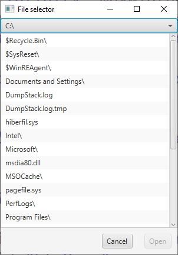

Programmation Java @ Et3
 
Polytech Paris-Saclay | 2020-21

___

# TP2

L'objectif de ce TP est de créer un sélecteur de fichiers, avec une interface proche de la figure suivante :

 
</img>
 

L'interface de ce sélecteur de fichier doit contenir : 
  - un menu déroulant (cf. [*ComboBox*](https://docs.oracle.com/javase/8/javafx/api/javafx/scene/control/ComboBox.html)), contenant une liste de tous les dossiers parents du dossier courant;
  - une liste navigable (cf. [*ListeView*](https://docs.oracle.com/javase/8/javafx/api/javafx/scene/control/ListView.html)), qui montre le contenu du dossier courant (les noms des sous-dossiers sont suivis pas un slash `/`); 
  - deux boutons (cf. [*Button*](https://docs.oracle.com/javase/8/javafx/api/javafx/scene/control/Button.html)), "Cancel" (pour fermer l'application) et "Open" (pour ouvrir un dossier sélectionné).

1. Télécharger [*Scene Builder*](https://gluonhq.com/products/scene-builder/). Ce programmee permet de creer des fenêtres JavaFX plus facilement.

> Une fois le programme téléchargé, une simple manipuulation vous permet de l'appeler depuis votre IDE.

> Pour associer *Scene Builder* à Eclipse, suivez les étapes suivantes :
>   1) Ouvrez la fenêtre des préférences (*Window* > *Preferences*);
>   2) Sélectionnez l'onglet *JavaFX*;
>   3) Dans *SceneBuilder executable*, entrez le chemin jusqu'à l'éxécutable de *Scene Builder*;
>   4) Validez en cliquant sur *Apply and Close*;
>   
> Il vous suffira alors d'effectuer un clic droit sur un fichier *fxml*, puis de cliquer sur *Open with SceneBuilder* pour éditer votre fichier avec *Scene Builder*.

> Pour associer *Scene Builder* à IntelliJ, suivez les étapes suivantes :
>   1) Ouvrez la fenêtre des paramètres (*File* > *Settings...*);
>   2) Sélectionnez l'onglet *Languages & Frameworks*, puis l'onglet *JavaFX*;
>   3) Dans *Path to SceneBuilder:*, entrez le chemin jusqu'à l'éxécutable de *Scene Builder*;
>   4) Validez en cliquant sur *Apply*, puis sur *OK*;
>   
> Il vous suffira alors d'effectuer un clic droit sur un fichier *fxml*, puis de cliquer sur *Open In SceneBuilder* pour éditer votre fichier avec *Scene Builder*.

2. Créez un projet javaFX.

> Dans Eclipse, allez dans *File* > *New* > *Project...* et selectionnez *JavaFX Project*, dans le répertoire "JavaFX".

> Dans IntelliJ, allez dans *File* > *New* > *Project...* et selectionnez *JavaFX Application*, dans l'onglet "JavaFX".

3. Créez un nouveau fichier "window.fxml", puis éditez-le avec *Scene Builder*. Créez alors votre fenêtre pour qu'elle ressemble au maximum à l'image présentée ci-dessus (Vous pouvez vous aider de ce [*tutoriel*](https://github.com/polytech-ihm-et3/TP2_squelette/tree/main/slides/slides.pdf)).

4. Ajoutez une classe "*Controller*" à votre projet et déclarez celle-ci comme étant le controlleur du fichier *fxml*.

> Créez une classe "*Controller*" et liez les éléments modifiables de l'interface à des attributs de cette classe en utilisant l'annotation [*@FXML*](https://docs.oracle.com/javafx/2/get_started/fxml_tutorial.htm). Les noms des attributs doivent correspondre aux noms indiqués dans les champs *fx:id*, lors de la création de la fenêtre. Il vous faudra aussi lier une méthode "*Initialize()*".
> Ajoutez un champs *fx:controller="[chemin jusqu'au].Controller"* à l'interieur de la balise correspondant au [*Pane*](https://docs.oracle.com/javase/8/javafx/api/javafx/scene/layout/Pane.html) principal (Vous pouvez vous aider de ce [*tutoriel*](https://github.com/polytech-ihm-et3/TP2_squelette/tree/main/slides/slides.pdf)).

5. Ajouter le fichier *FileSelector* à votre projet.

> On remarquera que la classe *FileSelector* possède deux méthodes intéressantes :
>   - La méthode *getListParentRepositories(String path)* : cette méthode renvoie une [*ArrayList*](https://docs.oracle.com/javase/8/docs/api/java/util/ArrayList.html) contenant les chemins des dossiers parents d'un dossier courant, indiqué en paramètre. Par exemple, pour un dossier *C:\rep1\rep2\rep3\*, la méthode renverra les chemins suivants : *C:\*, *C:\rep1\* et *C:\rep1\rep2\*
>   - La méthode *getContent(String path)* : cette méthode renvoie une [*ArrayList*](https://docs.oracle.com/javase/8/docs/api/java/util/ArrayList.html) contenant les différents éléments présents dans un dossier courant, indiqué en paramètre.

6. Implémentez la méthode "*Initialize()*" pour vous assurer que, lorsque l'utilisateur sélectionne un dossier dans le menu déroulant, la liste navigable et le menu déroulant se mettent bien à jour (ils doivent alors représenter le nouveau dossier courant).

7. Faites en sorte que le bouton "*Open*" ne soit cliquable qu'à condition que l'un des éléments de la liste navigable soit sélectionné.

8. Assurez vous que, si l'utilisateur clique sur le bouton "*Cancel*", la fenêtre se ferme.

9. Faites en sorte qu'après avoir sélectionner un élément de la liste navigable, un clique sur le bouton "*Open*" déclenche une des actions suivantes :
    - si l'élément sélectionné est un fichier : aucun effet;
    - si l'élément sélectionné est un répertoire : celui-ci devient le répertoire courant. L'interface doit alors se mettre à jour;
    - si l'élément sélectionné n'est ni un fichier, ni un répertoire : aucun effet.

10. Améliorez votre implémentation pour qu'un double clique sur un élement de la liste navigable ait le même effet qu'un clique sur le bouton "Open", après avoir sélectionné ce même élément.
